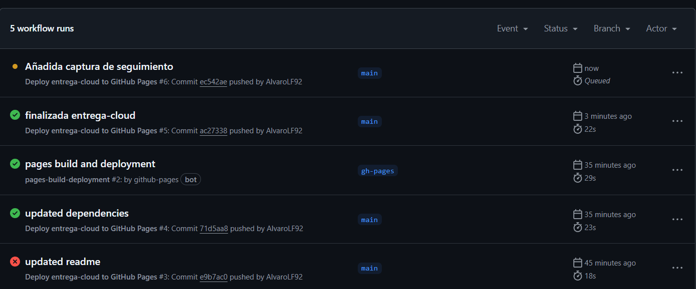

- Primero haremos un npm install y npm run build, puesto que ya tenemos un app desarrollada y un proyecto configurado con React y Vite.

    -Esto creará la carpeta /dist con el contenido listo para producción.
 
- Ahora procedemos a crear la rama de despliegue, pero antes:

      git add .
      git commit -m "preparar proyecto para github pages"
      git push origin main    

  - Y creamos la rama de despliegue con : git checkout -b gh-pages.    

- Ahora borraremos todo excepto dist y las carpetas de git: ( estos comandos son para bash, en otros terminales sería sintaxis diferente)

    - shopt -s extglob
    - rm -rf !(dist|.git|.github) 

- Y moveremos el contenido de dist/ a la raiz del proyecto:

    - mv dist/* . && rm -rf dist

- Ahora realizaremosla subida de nuestros archivos a gh-pages , para ello:

    git add .
    git commit -m "Deploy manual a GitHub Pages"
    git push -u origin gh-pages

- Podemos comprobar que el despliegue manual fué un éxito en la direccion : https://alvarolf92.github.io/entrega-cloud/    

- Se ha configurado un archivo deploy.yml en .github/workflows/ y un script en package.json para facilitar el despliegue automático. Esto permite desplegar mediante:

- npm run deploy ( O automáticamente tras hacer push o merge a la rama main. ).

El ejercicio se ha mantenido en el mismo repositorio para permitir visualizar tanto el resultado del Ejercicio 1 como su despliegue en línea, además de facilitar el seguimiento desde este README.

